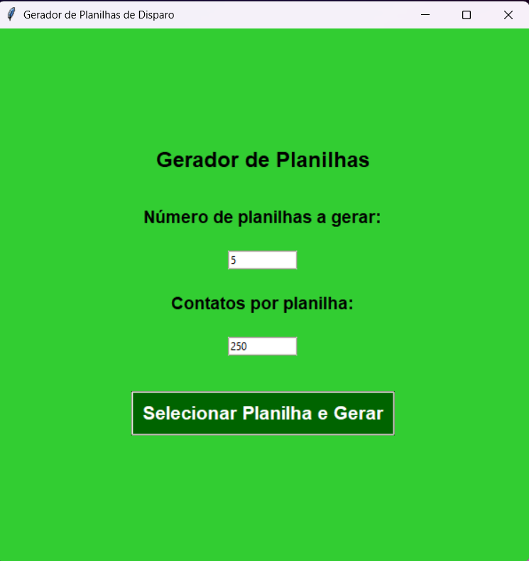

Gerador de Planilhas de Disparo 

Aplicativo em Python + Tkinter para gerar automaticamente planilhas Excel segmentadas a partir de uma base original de contatos — ideal para disparos e campanhas de prospecção via WhatsApp.

🧠 Contexto

Projeto criado para uso interno na Frexco, com o objetivo de automatizar a segmentação de leads e organizar contatos de estabelecimentos do setor hortifruti em planilhas menores e padronizadas para disparos.

O sistema:

Lê uma planilha original de contatos;

Gera automaticamente várias planilhas menores;

Salva o progresso em um arquivo .json para continuar de onde parou;

Permite corrigir os nomes das colunas caso estejam diferentes;

Apresenta uma interface simples e intuitiva com Tkinter.

⚙️ Funcionalidades

✅ Interface gráfica simples (Tkinter)
✅ Geração automática de múltiplas planilhas Excel
✅ Ajuste automático da largura das colunas
✅ Salvamento de progresso (.json)
✅ Correção de nomes de colunas caso estejam diferentes
✅ Controle de quantos contatos por planilha e quantas planilhas gerar

🧩 Tecnologias utilizadas

Python 3

Tkinter (interface gráfica)

Pandas (manipulação de planilhas)

OpenPyXL (formatação Excel)

JSON (salvamento de progresso)

🖥️ Como executar o projeto
1️⃣ Clonar o repositório
git clone https://github.com/seuusuario/gerador-planilhas-disparo.git
cd gerador-planilhas-disparo

2️⃣ Instalar as dependências
pip install -r requirements.txt

3️⃣ Executar o programa
python main.py

🧾 Como usar

Execute o programa.

Informe o número de planilhas e quantos contatos por planilha.

Selecione a planilha original (.xlsx).

O sistema gerará as planilhas automaticamente na pasta planilhas_disparo.

Caso as colunas tenham nomes diferentes, será aberta uma janela para corrigir.

📂 Saída gerada

As planilhas são salvas com nomes como:

planilhas_disparo/disparo_1.xlsx
planilhas_disparo/disparo_2.xlsx
...

E o arquivo de controle:

controle.json

🧑‍💻 Autor

Miguel Arantes
Estagiário em suporte de IA e vendas digitais 
💼 Automação de processos | IA aplicada a vendas e prospecção

💡 Exemplo de uso

O aplicativo foi usado internamente para gerar planilhas de disparos automáticos de WhatsApp a partir de bases de clientes, otimizando o processo de triagem e captação de leads pela equipe de vendas.

